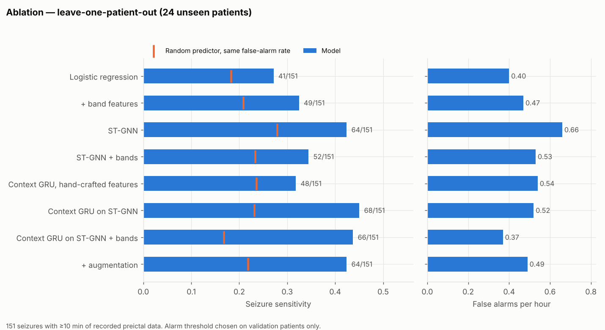
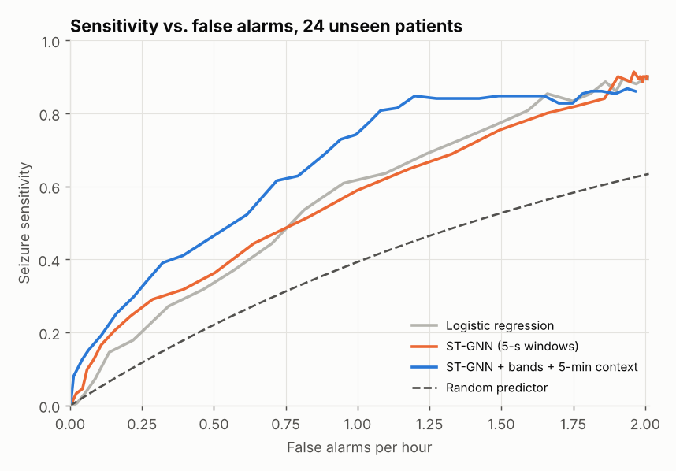
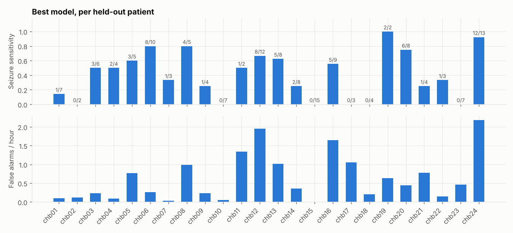
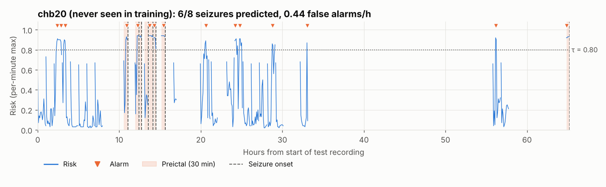
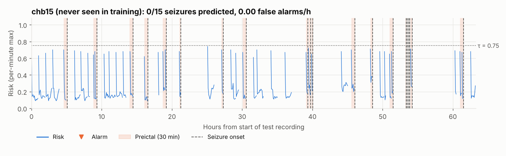
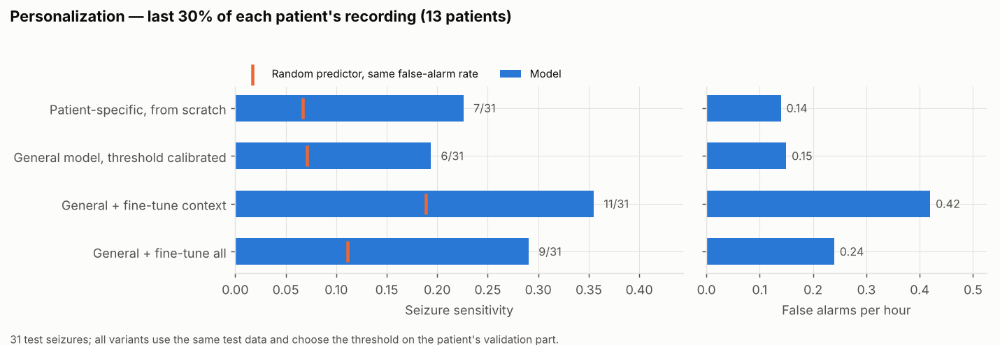

# 🧠 Synchrony-Driven Seizure Prediction via ST-GNN

> A Spatio-Temporal Graph Neural Network for early epileptic seizure prediction on the
> CHB-MIT scalp EEG database, evaluated the way a deployed warning system would be judged.

[]()
[]()
[]()
[]()
[]()

---

## 0. Summary

**Goal:** warn patients minutes before a seizure, from scalp EEG.

**Idea:** in the minutes before a seizure, brain regions become increasingly
phase-synchronised. Each 5-second EEG window becomes a graph whose nodes are electrode
channels and whose edges are Phase Locking Values (PLV) in several frequency bands. A graph
attention network embeds each window; a recurrent model reads the last 5 minutes of
embeddings and outputs a **continuous risk score** that rises toward onset.

**Result (24 patients, each tested without ever being seen in training, 151 seizures):**

| | Best model |
|---|---|
| Seizures predicted | **66 / 151 (44%)** |
| False alarms | **0.37 per hour** (about one every 2.7 hours) |
| Mean warning time | **19.4 minutes** before onset |
| Random predictor at the same false-alarm rate | 17% of seizures |
| Significance vs. chance | p = 9 × 10⁻¹⁵ |

Fine-tuning that general model on a patient's own early recordings improves it further
for that patient (Section 7.3).

**How this version came about.** v2 reported a window-level AUC of 0.883 using a random
split that leaked information between training and test data. v3 rebuilds everything, from
raw EDF files to seizure-level metrics, as tested and reproducible code, and reports what
the model does on data it has truly never seen ([Section 8](#8-what-changed-from-v2-and-why)).

---

## 1. Pipeline

```
 raw EDF + summary files
        │  src/preprocess.py
        ▼
 18-channel bipolar EEG ─► 0.5–40 Hz ─► 128 Hz ─► 5-s windows
 ─► broadband + 5-band PLV graphs, relative band power
 every window kept, with absolute timestamps and true seizure ids
        │  src/train.py          window encoder (ST-GNN)
        │  src/context.py        5-minute context model on window embeddings
        │  src/personalize.py    optional: fine-tune on one patient's early data
        ▼
 risk score r_t ∈ [0,1] for every window of each held-out recording
        │  src/evaluate.py
        ▼
 alarms (3-of-5 windows ≥ τ, 30-min refractory) ─► per-seizure sensitivity,
 false alarms / hour, lead time, p-value vs. random predictor
```

---

## 2. Model

```
Window: 18 channels × 640 samples (5 s at 128 Hz), z-scored per channel
    │
    ├── fully connected channel graph ──► GATv2 spatial branch ──► z_s ∈ R^64
    │      edge features: PLV in broadband, delta, theta, alpha, beta, gamma (6)
    │      node features: Conv1d encoder of the channel signal (64) + relative band power (5)
    │      GATv2Conv(→64, 8 heads) → GATv2Conv(→64) → mean pool
    │
    └── channel-mean signal ──► temporal conv branch ──► z_t ∈ R^64
    │
    concat(z_s, z_t) → Linear → GELU → Dropout ──► window embedding e_t ∈ R^64
                                               └─► logit (window encoder training)

Context model:  e_{t-59} … e_t  (last 5 minutes) ──► GRU(64) ──► risk r_t
```

**Soft labels.** A binary label treats a window 30 minutes before onset the same as one 10
seconds before. Preictal windows instead get a target that rises with proximity to onset:

```
r̃_t = 0.10 + 0.90 × (1 − time_to_onset / SOP)          (interictal: r̃_t = 0)
L   = α · MSE(σ(z_t), r̃_t) + (1 − α) · BCE(z_t, y_t),   α = 0.5
```

**Why two stages.** The window encoder learns what synchrony looks like in 5 seconds; the
context model learns how it *evolves* over minutes, and suppresses isolated spikes. The
context model is causal: it only uses past windows, and never reads across a recording gap.

---

## 3. Data and preprocessing

**CHB-MIT Scalp EEG Database** ([PhysioNet](https://physionet.org/content/chbmit/1.0.0/)):
22 pediatric patients in 24 cases. After preprocessing: 981 hours of recording, 191 seizures
(2 files with incompatible channels skipped).

| Decision | Choice | Why |
|---|---|---|
| Channels | 18 bipolar double-banana channels | Present in almost every file; v2's 23 header channels include a duplicate and vary across subjects. Referential-montage files are converted by subtracting references; unconvertible files are skipped and listed in `report.json`. |
| Filtering / rate | 0.5–40 Hz zero-phase Butterworth, resampled to 128 Hz | Keeps all content below 40 Hz; halves storage and compute. |
| Windows | 5 s, non-overlapping, **every window kept** in recording order | False alarms per hour are measured on all interictal hours (766 h in leave-one-patient-out). |
| Timeline | Absolute time from summary clock times, with midnight rollover | Preictal periods that cross file boundaries are labelled correctly. |
| Preictal | 30 min before onset (seizure occurrence period, SOP) | Standard horizon. |
| Postictal | 5 min after offset, excluded | Neither normal nor preictal. |
| Interictal | ≥ 60 min from any seizure | Keeps "normal" data clearly separated from seizure activity. |
| Band features | PLV per band from the band-filtered continuous signal; log relative band power per channel | Pre-seizure changes are often band-specific; relative power survives z-scoring. |
| Normalisation | Per-window, per-channel z-score | Removes amplitude differences between patients and electrodes. |
| Class balance | Each training epoch draws 50% preictal / 50% interictal windows | Interictal windows far outnumber preictal ones. |

---

## 4. Evaluation protocol

**Splits.** No test window, or its neighbour in time, is ever seen in training.

- **Leave-one-patient-out (cross-subject):** train on 20 subjects, choose the epoch and the
  alarm threshold on 3 other subjects, test on the held-out subject. One fold per subject.
- **Chronological (patient-specific):** within one subject, train on the first ~50% of the
  recording, validate on the next ~20%, test on the last ~30%. Cuts never split a preictal
  period. 13 subjects have the ≥ 3 seizures this needs.

**From risk to alarms.** An alarm fires when at least 3 of the last 5 windows within one
continuous recording exceed τ; further alarms are suppressed for 30 minutes. τ is chosen
on validation data only, maximising seizure sensitivity subject to ≤ 0.5 false alarms/hour.

**Metrics.**

- **Seizure sensitivity:** fraction of seizures with an alarm in their 30-minute preictal period.
- **False alarms per hour:** alarms during interictal data ÷ interictal hours.
- **Lead time:** per seizure, from the first alarm to onset.
- **Random-predictor test:** alarms at random with the same false-alarm rate catch a seizure
  with probability p = 1 − exp(−FPR × SOP) (Schelter et al., 2006); a binomial test gives
  the p-value of the model's sensitivity against it.
- Seizures with < 10 min of recorded preictal data are not scored (26 in leave-one-patient-out).
- Window-level ROC-AUC per subject is reported for comparison with other work.

---

## 5. Quick start

```bash
# RTX 50-series (Blackwell) GPUs need a CUDA 12.8+ PyTorch build
pip install torch --index-url https://download.pytorch.org/whl/cu128
pip install -r requirements.txt

python -m pytest tests                    # 36 tests, CPU, < 1 min, no dataset needed
bash run_all.sh /path/to/chb-mit          # every result in this README, end to end
jupyter notebook notebooks/stgnn_v3_walkthrough.ipynb   # or step through it cell by cell
```

The best model, step by step:

```bash
P=data/processed_v3
python -m src.preprocess --raw_dir /path/to/chb-mit --out_dir $P --workers 4
python -m src.train   --processed_dir $P --protocol lopo --features bands --out_dir results/stgnn_bands_lopo
python -m src.context --processed_dir $P --source results/stgnn_bands_lopo --out_dir results/context_stgnn_bands_lopo
python -m src.evaluate --results_dir results/context_stgnn_bands_lopo
python -m src.figures  --results_dir results/context_stgnn_bands_lopo

# personalization (uses the leave-one-patient-out models above)
python -m src.personalize --processed_dir $P --general_encoder results/stgnn_bands_lopo \
    --general_context results/context_stgnn_bands_lopo --out_dir results/personalized
```

To try the pipeline without the dataset, `python -m tests.make_synthetic_chbmit --out
data/synthetic` builds small synthetic EDF files with CHB-MIT's quirks.

---

## 6. Key hyperparameters

| Component | Setting |
|---|---|
| Window encoder | Adam, lr 3e-4, weight decay 1e-4, cosine schedule; 30 epochs × 40,000 class-balanced windows; early stopping (patience 8) on validation AUC; batch 128; dropout 0.4; BF16 on CUDA |
| Context model | GRU, hidden 64, 60-window (5-min) history; Adam, lr 1e-3; early stopping (patience 6) |
| Personalization | encoder lr 1e-4 (≤ 10 epochs), context lr 3e-4 (≤ 15 epochs), early stopping on the patient's validation part |
| Loss | α = 0.5 MSE / BCE |

---

## 7. Results

All numbers are on held-out data, produced by `src.evaluate`. Every run uses the same alarm
rule and chooses its threshold on validation data only.

### 7.1 Ablation: what each component contributes (leave-one-patient-out)

24 patients, each tested by a model that never saw them; 151 scored seizures, 766 interictal hours.

| Model | Seizures predicted | False alarms / h | Random predictor | p vs. chance | Mean lead time | Window AUC |
|---|---|---|---|---|---|---|
| Logistic regression (PLV + power) | 41 (27%) | 0.40 | 18% | 0.005 | 17.9 min | 0.53 ± 0.09 |
| Logistic regression + band features | 49 (32%) | 0.47 | 21% | 6 × 10⁻⁴ | 16.7 min | 0.53 ± 0.10 |
| ST-GNN (5-s windows) | 64 (42%) | 0.66 | 28% | 1 × 10⁻⁴ | 14.6 min | 0.52 ± 0.13 |
| ST-GNN + band features | 52 (34%) | 0.53 | 23% | 0.001 | 16.9 min | 0.52 ± 0.13 |
| Context GRU on hand-crafted features | 48 (32%) | 0.54 | 24% | 0.014 | 18.7 min | 0.57 ± 0.15 |
| Context GRU on ST-GNN | 68 (45%) | 0.52 | 23% | 2 × 10⁻⁹ | 18.3 min | 0.56 ± 0.16 |
| **Context GRU on ST-GNN + bands** | **66 (44%)** | **0.37** | **17%** | **9 × 10⁻¹⁵** | **19.4 min** | 0.56 ± 0.15 |
| … + training-time augmentation | 64 (42%) | 0.49 | 22% | 1 × 10⁻⁸ | 17.7 min | 0.54 ± 0.15 |



**What this shows**

- **Minutes of context is the most valuable component for the graph network.** Adding the
  5-minute GRU improved both ST-GNN variants on both axes at once (more seizures, fewer
  false alarms), mainly by suppressing isolated false alarms. On hand-crafted features it
  did not beat plain logistic regression (48 vs 49 seizures, 0.54 vs 0.47 false alarms/h).
- **Band features help only with context.** Alone they made the ST-GNN worse (64 → 52
  seizures): a single 5-s window with 306 six-feature edges is noisy. Over 5 minutes, the
  richer features pay off: the best model has the lowest false-alarm rate of all.
- **The graph network adds something hand-crafted features don't.** With the same context
  model, ST-GNN embeddings predict 66–68 seizures; hand-crafted band features predict 48.
- **Augmentation hurt** (time shift, noise, masking, channel gain, channel dropout, PLV
  jitter): fewer seizures, more false alarms. The main difficulty is variability *between*
  patients, which within-patient perturbations don't simulate, and noise blurs an already
  subtle signal.
- **Window AUC stays near 0.55** although alarms are far better than chance: most windows
  are hard to tell apart, but the model's high-confidence episodes cluster before seizures.
  Event-level metrics are what matter for a warning system.



### 7.2 Per patient: large differences



The best model works well for some patients and not at all for others. chb20 below: 6 of 8
seizures predicted with 0.44 false alarms/h, by a model that never saw this patient.



chb15: none of 15 seizures predicted. Its risk stays low before every seizure; whatever
precedes this patient's seizures is not the pattern the other patients taught the model.



### 7.3 Personalization

The 13 patients with ≥ 3 seizures. Each starts from the leave-one-patient-out model that
never saw them, adapts on the first ~50% of their recording, and is tested on the last ~30%
(31 seizures, 115 interictal hours).

| Variant | Seizures predicted | False alarms / h | Random predictor | p vs. chance | Window AUC |
|---|---|---|---|---|---|
| Patient-specific model trained from scratch | 7 | 0.14 | 7% | 0.004 | 0.60 |
| General model, only the threshold calibrated | 6 | 0.15 | 7% | 0.02 | 0.59 |
| General model + fine-tuned context GRU | 11 | 0.42 | 19% | 0.02 | 0.65 |
| **General model + fine-tuned encoder and context** | **9** | **0.24** | **11%** | **0.005** | **0.62** |



- **Starting from the general model beats starting from nothing:** both fine-tuned variants
  predict more seizures and separate preictal from normal EEG better than a patient-specific
  model trained only on that patient's data.
- **Fine-tuning everything is the most balanced option.** Fine-tuning only the context model
  catches the most seizures, but with about three times the false-alarm rate of the
  calibrated general model (0.42 vs 0.15 per hour).
- It fixes patients the general model fails on: chb01 goes from 0/1 (window AUC 0.53) to 1/1 (0.74).
- With 31 test seizures, differences of 2–4 seizures are suggestive rather than conclusive.

### 7.4 Patient-specific models (chronological protocol)

Same 13 patients and test data as 7.3, models trained only on each patient's own data.

| Model | Seizures predicted | False alarms / h | p vs. chance |
|---|---|---|---|
| Logistic regression | 7 | 0.31 | 0.15 |
| Logistic regression + bands | 8 | 0.17 | 0.003 |
| ST-GNN | 6 | 0.16 | 0.03 |
| ST-GNN + bands | 6 | 0.27 | 0.19 |
| Context GRU, hand-crafted features | 9 | 0.21 | 0.002 |
| Context GRU on ST-GNN | 7 | 0.17 | 0.01 |
| Context GRU on ST-GNN + bands | 7 | 0.14 | 0.004 |

With only the first half of one patient's recording (often 2–3 seizures) for training,
all models are data-limited, which is why pretraining on other patients (7.3) helps.

---

## 8. What changed from v2, and why

| v2 problem | Consequence | v3 fix |
|---|---|---|
| All windows from all subjects shuffled, then split 70/15/15 | Every subject in train and test; neighbouring windows of the same preictal period on both sides. Results were not cross-subject, and overstated. | Leave-one-patient-out and forward-in-time splits |
| Per-subject and lead-time analyses on all of each subject's windows | ~70% of evaluated windows had been used for training | Evaluation only on held-out data |
| Lead time summed over all of a subject's seizures | Values above the 30-min horizon (54.8 min); r = 0.999 with preictal window count | Lead time per seizure |
| Window-level metrics only | No false-alarm rate; no comparison with chance | Event metrics, false alarms per hour, random-predictor test |
| Preprocessing not in the repo; windows without timestamps | Chronology and seizure boundaries could not be verified | `src/preprocess.py`: timestamped windows, true seizure ids |
| Interictal data subsampled (~3 h of ~40 h for chb01) | False-alarm rate cannot be measured | Every window kept; training subsamples on the fly |
| MSE applied to the logit | Unbounded output compared with a 0–1 target | MSE on σ(logit) |
| No baseline | No way to tell whether the graph network adds value | Logistic regression on the same features and folds |

Section 9 of `notebooks/stgnn_v3_walkthrough.ipynb` trains the same v3 model with v2's
random window split for comparison. In a short demo run, chb01 scored a test AUC of 0.91
with the random split, against 0.21 when chb01 is truly unseen. The v2 notebooks and checkpoint are kept in
`legacy/`; their numbers should not be cited.

---

## 9. Project structure

```
seizure-prediction-stgnn/
├── run_all.sh               ← reproduces every result in this README from raw EDF files
├── src/
│   ├── edf.py               ← EDF reader (numpy)
│   ├── chbmit.py            ← summary parsing, timeline, montage, window labels
│   ├── preprocess.py        ← EDF → timestamped windows, broadband/band PLV, band power
│   ├── inspect_segments.py  ← data sanity report
│   ├── data.py              ← memory-mapped per-subject access, soft labels
│   ├── splits.py            ← leave-one-patient-out, chronological splits
│   ├── model.py             ← ST-GNN window encoder, graph builder, loss
│   ├── train.py             ← window-encoder training + predictions per fold
│   ├── augment.py           ← training-time augmentation
│   ├── context.py           ← 5-minute context GRU
│   ├── personalize.py       ← fine-tune the general model per patient
│   ├── baseline.py          ← logistic-regression baseline
│   ├── metrics.py           ← alarms, seizure-level metrics, threshold selection
│   ├── evaluate.py          ← final metrics and tables
│   ├── figures.py           ← plots per run
│   └── config.py
├── tools/readme_figures.py  ← README figures (export from results/, render anywhere)
├── docs/figures/            ← README figures and the data they are drawn from
├── tests/                   ← 36 tests: preprocessing, splits, metrics, augmentation, end to end
├── notebooks/
│   └── stgnn_v3_walkthrough.ipynb  ← every pipeline step, cell by cell
└── legacy/                  ← v2 notebooks and checkpoint (leaky evaluation)
```

---

## 10. Limitations

- **Model selection used the same test patients.** Eight variants were compared on the
  leave-one-patient-out results, and the best is reported. Each run's threshold and epoch
  are chosen on validation data, but picking the best *variant* this way is mildly
  optimistic; a fresh dataset (e.g. the Siena Scalp EEG Database) is the proper next test.
- **Recording-start artifact.** The context model starts each recording file with an empty
  history, which raises the risk to ~0.65–0.7 for the first minute of every file (visible in
  the chb15 timeline). It stays below most thresholds but should be fixed, e.g. by training
  with short histories or suppressing the first minutes of a file.
- **Strong differences between patients.** For 6 of 24 patients (e.g. chb10, chb15,
  chb23) the general model raises no correct alarm; personalization helps some of them
  (chb10: 0/5 → 2/5 test seizures), not all (chb13: 0/5 in every variant).
- **Single dataset:** pediatric scalp EEG from one hospital; adults and other recording
  setups are untested.
- **Offline evaluation:** the pipeline is causal, but it has not been run as a live stream.
- **Small patient-specific test set:** 31 seizures in Sections 7.3–7.4.
- **Fixed SOP of 30 minutes;** the best horizon may differ between patients.

---

## 11. Citation

```bibtex
@mastersthesis{castro2026stgnn,
  author = {Castro Aviles, Mauricio},
  title  = {Synchrony-Driven {AI} for Seizure Prediction via
            Spatio-Temporal Graph Neural Networks},
  school = {Stevens Institute of Technology},
  type   = {M.S. Applied Artificial Intelligence},
  year   = {2026}
}
```

## License
MIT — see the LICENSE file.

*Mauricio Castro Aviles — Stevens Institute of Technology, M.S. Applied Artificial Intelligence*
