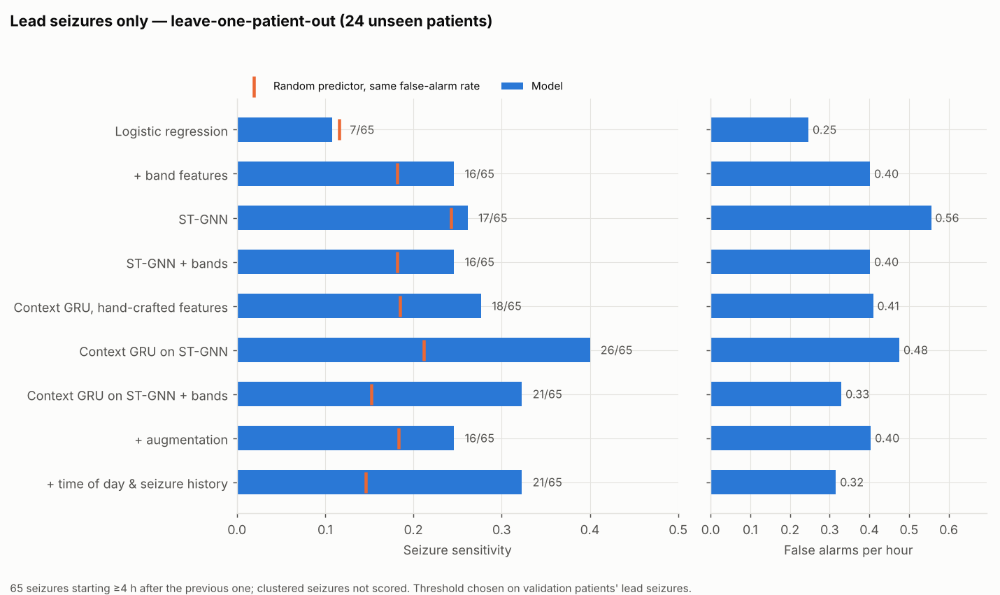

# 🧠 Synchrony-Driven Seizure Prediction via ST-GNN

> A Spatio-Temporal Graph Neural Network for early epileptic seizure prediction on the
> CHB-MIT scalp EEG database, evaluated the way a deployed warning system would be judged.

[]()
[]()
[]()
[]()
[]()

---

> ### ⚠ Correction (5 Oct 2026): the context-model results were inflated
> The 5-minute context model (`src/context.py`) built each window's history from **labelled
> windows only**. Unlabelled windows (seizures, postictal periods, the 30–60-min buffers) were
> dropped, so the history breaks right before every preictal period, and *how much history a
> window has* gives its label away. A control model that sees **no EEG at all**, only that gap
> pattern, predicts **120 of 151 seizures** (58 of 65 lead seizures) at 0.21 false alarms/h.
>
> Reading the history from **every recorded window**, as a live system would, removes the leak
> (the same control predicts 4/151). With that fix the best context model, ST-GNN + bands with
> 5 minutes of history, predicts **61 ± 1 / 151 seizures at 0.48 false alarms/h** (3 seeds,
> p ≈ 10⁻⁷) and **14 ± 2 / 65 lead seizures** (chance 15%; significant in 2 of 3 seeds).
> Longer histories (15–60 min) do not improve it.
>
> Rows marked † below come from the leaky context model and overstate performance; the window-level
> models (no context) and the evaluation code are not affected. The corrected model and the full
> analysis (no-EEG controls, 5–60-minute histories, CNN encoders) are in
> [seizure-prediction-cnn](https://github.com/mcastroavi/seizure-prediction-cnn) (`src/long_context.py`, `Long_context_walkthrough.ipynb`).

## 0. Summary

**Goal:** warn patients minutes before a seizure, from scalp EEG.

**Idea:** in the minutes before a seizure, brain regions become increasingly
phase-synchronised. Each 5-second EEG window becomes a graph whose nodes are electrode
channels and whose edges are Phase Locking Values (PLV) in several frequency bands. A graph
attention network embeds each window; a recurrent model reads the last 5 minutes of
embeddings and outputs a **continuous risk score** that rises toward onset.

**Result (24 patients, each tested by a model that never saw them; corrected, see above):**

| Best model (ST-GNN + bands, 5-min context, history from every window; 3 seeds) | All seizures | Lead seizures only |
|---|---|---|
| Seizures predicted | **61 ± 1 / 151 (41%)** | 14 ± 2 / 65 (22%) |
| False alarms per hour | 0.48 | 0.32 |
| Mean warning time | 17.6 min | |
| Random predictor at the same false-alarm rate | 21% | 15% |
| p vs. chance | ≈ 10⁻⁷ | 0.02–0.33 (2 of 3 seeds < 0.05) |

**Lead seizures** (starting ≥ 4 h after the previous one) are the stricter test. Many
CHB-MIT seizures come in clusters, and a model can catch those by learning "another
seizure is likely soon" rather than by recognising pre-seizure EEG. After the correction,
no model is robustly better than chance on lead seizures: the gain from context is mostly
on clustered seizures.

**How this version came about.** v2 reported a window-level AUC of 0.883 using a random
split that leaked information between training and test data. v3 rebuilds everything, from
raw EDF files to seizure-level metrics, as tested and reproducible code, and reports what
the model does on data it has truly never seen ([Section 8](#8-what-changed-from-v2-and-why)).

---

## 1. Pipeline

```
 raw EDF + summary files
        │  src/preprocess.py
        ▼
 18-channel bipolar EEG ─► 0.5–40 Hz ─► 128 Hz ─► 5-s windows
 ─► broadband + 5-band PLV graphs, relative band power
 every window kept, with absolute timestamps and true seizure ids
        │  src/train.py          window encoder (ST-GNN)
        │  src/context.py        5-minute context model on window embeddings
        │  src/personalize.py    optional: fine-tune on one patient's early data
        ▼
 risk score r_t ∈ [0,1] for every window of each held-out recording
        │  src/evaluate.py
        ▼
 alarms (3-of-5 windows ≥ τ, 30-min refractory) ─► per-seizure sensitivity,
 false alarms / hour, lead time, p-value vs. random predictor
```

---

## 2. Model

```
Window: 18 channels × 640 samples (5 s at 128 Hz), z-scored per channel
    │
    ├── fully connected channel graph ──► GATv2 spatial branch ──► z_s ∈ R^64
    │      edge features: PLV in broadband, delta, theta, alpha, beta, gamma (6)
    │      node features: Conv1d encoder of the channel signal (64) + relative band power (5)
    │      GATv2Conv(→64, 8 heads) → GATv2Conv(→64) → mean pool
    │
    └── channel-mean signal ──► temporal conv branch ──► z_t ∈ R^64
    │
    concat(z_s, z_t) → Linear → GELU → Dropout ──► window embedding e_t ∈ R^64
                                               └─► logit (window encoder training)

Context model:  e_{t-59} … e_t  (last 5 minutes) ──► GRU(64) ──► risk r_t
```

**Soft labels.** A binary label treats a window 30 minutes before onset the same as one 10
seconds before. Preictal windows instead get a target that rises with proximity to onset:

```
r̃_t = 0.10 + 0.90 × (1 − time_to_onset / SOP)          (interictal: r̃_t = 0)
L   = α · MSE(σ(z_t), r̃_t) + (1 − α) · BCE(z_t, y_t),   α = 0.5
```

**Why two stages.** The window encoder learns what synchrony looks like in 5 seconds; the
context model learns how it *evolves* over minutes, and suppresses isolated spikes. The
context model is causal: it only uses past windows, and never reads across a recording gap.

---

## 3. Data and preprocessing

**CHB-MIT Scalp EEG Database** ([PhysioNet](https://physionet.org/content/chbmit/1.0.0/)):
22 pediatric patients in 24 cases. After preprocessing: 981 hours of recording, 191 seizures
(2 files with incompatible channels skipped).

| Decision | Choice | Why |
|---|---|---|
| Channels | 18 bipolar double-banana channels | Present in almost every file; v2's 23 header channels include a duplicate and vary across subjects. Referential-montage files are converted by subtracting references; unconvertible files are skipped and listed in `report.json`. |
| Filtering / rate | 0.5–40 Hz zero-phase Butterworth, resampled to 128 Hz | Keeps all content below 40 Hz; halves storage and compute. |
| Windows | 5 s, non-overlapping, **every window kept** in recording order | False alarms per hour are measured on all interictal hours (766 h in leave-one-patient-out). |
| Timeline | Absolute time from summary clock times, with midnight rollover | Preictal periods that cross file boundaries are labelled correctly. |
| Preictal | 30 min before onset (seizure occurrence period, SOP) | Standard horizon. |
| Postictal | 5 min after offset, excluded | Neither normal nor preictal. |
| Interictal | ≥ 60 min from any seizure | Keeps "normal" data clearly separated from seizure activity. |
| Band features | PLV per band from the band-filtered continuous signal; log relative band power per channel | Pre-seizure changes are often band-specific; relative power survives z-scoring. |
| Normalisation | Per-window, per-channel z-score | Removes amplitude differences between patients and electrodes. |
| Class balance | Each training epoch draws 50% preictal / 50% interictal windows | Interictal windows far outnumber preictal ones. |

---

## 4. Evaluation protocol

**Splits.** No test window, or its neighbour in time, is ever seen in training.

- **Leave-one-patient-out (cross-subject):** train on 20 subjects, choose the epoch and the
  alarm threshold on 3 other subjects, test on the held-out subject. One fold per subject.
- **Chronological (patient-specific):** within one subject, train on the first ~50% of the
  recording, validate on the next ~20%, test on the last ~30%. Cuts never split a preictal
  period. 13 subjects have the ≥ 3 seizures this needs.

**From risk to alarms.** An alarm fires when at least 3 of the last 5 windows within one
continuous recording exceed τ; further alarms are suppressed for 30 minutes. τ is chosen
on validation data only, maximising seizure sensitivity subject to ≤ 0.5 false alarms/hour.

**Metrics.**

- **Seizure sensitivity:** fraction of seizures with an alarm in their 30-minute preictal period.
- **False alarms per hour:** alarms during interictal data ÷ interictal hours.
- **Lead time:** per seizure, from the first alarm to onset.
- **Random-predictor test:** alarms at random with the same false-alarm rate catch a seizure
  with probability p = 1 − exp(−FPR × SOP) (Schelter et al., 2006); a binomial test gives
  the p-value of the model's sensitivity against it.
- Seizures with < 10 min of recorded preictal data are not scored (26 in leave-one-patient-out).
- **Lead seizures:** every result is also reported for lead seizures only, those starting
  ≥ 4 h after the end of the previous seizure (65 of the 177 test seizures with enough
  preictal data in leave-one-patient-out). Clustered seizures then count neither as hits nor
  misses, also when the threshold is chosen on validation data.
- Window-level ROC-AUC per subject is reported for comparison with other work.

---

## 5. Quick start

```bash
# RTX 50-series (Blackwell) GPUs need a CUDA 12.8+ PyTorch build
pip install torch --index-url https://download.pytorch.org/whl/cu128
pip install -r requirements.txt

python -m pytest tests                    # 42 tests, CPU, < 1 min, no dataset needed
bash run_all.sh /path/to/chb-mit          # every result in this README, end to end
jupyter notebook notebooks/stgnn_v3_walkthrough.ipynb   # or step through it cell by cell
```

The best model, step by step:

```bash
P=data/processed_v3
python -m src.preprocess --raw_dir /path/to/chb-mit --out_dir $P --workers 4
python -m src.train   --processed_dir $P --protocol lopo --features bands --out_dir results/stgnn_bands_lopo
python -m src.context --processed_dir $P --source results/stgnn_bands_lopo --out_dir results/context_stgnn_bands_lopo
python -m src.evaluate --results_dir results/context_stgnn_bands_lopo
python -m src.evaluate --results_dir results/context_stgnn_bands_lopo \
    --lead_gap_h 4 --processed_dir $P --out_dir results/context_stgnn_bands_lopo/lead4h
python -m src.figures  --results_dir results/context_stgnn_bands_lopo

# context model with hour of day and time since the last seizure
python -m src.context --processed_dir $P --source results/stgnn_bands_lopo --extra time,history \
    --out_dir results/context_stgnn_bands_timehist_lopo

# personalization (uses the leave-one-patient-out models above)
python -m src.personalize --processed_dir $P --general_encoder results/stgnn_bands_lopo \
    --general_context results/context_stgnn_bands_lopo --out_dir results/personalized
```

To try the pipeline without the dataset, `python -m tests.make_synthetic_chbmit --out
data/synthetic` builds small synthetic EDF files with CHB-MIT's quirks.

---

## 6. Key hyperparameters

| Component | Setting |
|---|---|
| Window encoder | Adam, lr 3e-4, weight decay 1e-4, cosine schedule; 30 epochs × 40,000 class-balanced windows; early stopping (patience 8) on validation AUC; batch 128; dropout 0.4; BF16 on CUDA |
| Context model | GRU, hidden 64, 60-window (5-min) history; Adam, lr 1e-3; early stopping (patience 6) |
| Context extras (optional) | hour of day (sin, cos); log time since the last seizure ended, clipped to [1 h, 72 h]; has-previous-seizure flag |
| Personalization | encoder lr 1e-4 (≤ 10 epochs), context lr 3e-4 (≤ 15 epochs), early stopping on the patient's validation part |
| Loss | α = 0.5 MSE / BCE |

---

## 7. Results

All numbers are on held-out data, produced by `src.evaluate`. Every run uses the same alarm
rule and chooses its threshold on validation data only. Each model is scored on **all
seizures** and on **lead seizures only** (Section 4).

### 7.1 Ablation: what each component contributes (leave-one-patient-out)

24 patients, each tested by a model that never saw them; 766 interictal hours.

| Model | All seizures (151): predicted | FA/h | p | Lead seizures (65): predicted | FA/h | chance | p |
|---|---|---|---|---|---|---|---|
| Logistic regression (PLV + power) | 41 (27%) | 0.40 | 0.005 | 7 (11%) | 0.25 | 12% | 0.64 |
| Logistic regression + band features | 49 (32%) | 0.47 | 6 × 10⁻⁴ | 16 (25%) | 0.40 | 18% | 0.12 |
| ST-GNN (5-s windows) | 64 (42%) | 0.66 | 1 × 10⁻⁴ | 17 (26%) | 0.56 | 24% | 0.41 |
| ST-GNN + band features | 52 (34%) | 0.53 | 0.001 | 16 (25%) | 0.40 | 18% | 0.12 |
| ST-GNN + bands + augmentation | 49 (32%) | 0.62 | 0.06 | 22 (34%) | 0.46 | 21% | 0.008 |
| Context GRU on hand-crafted features † | 48 (32%) | 0.54 | 0.014 | 18 (28%) | 0.41 | 19% | 0.046 |
| Context GRU on ST-GNN † | 68 (45%) | 0.52 | 2 × 10⁻⁹ | **26 (40%)** | 0.48 | 21% | 4 × 10⁻⁴ |
| Context GRU on ST-GNN + bands † | 66 (44%) | 0.37 | 9 × 10⁻¹⁵ | 21 (32%) | 0.33 | 15% | 4 × 10⁻⁴ |
| … + augmentation † | 64 (42%) | 0.49 | 1 × 10⁻⁸ | 16 (25%) | 0.40 | 18% | 0.13 |
| … + time of day † | 49 (32%) | 0.40 | 2 × 10⁻⁵ | 14 (22%) | 0.36 | 17% | 0.18 |
| … + seizure history † | **88 (58%)** | 0.44 | 5 × 10⁻²⁵ | 16 (25%) | 0.37 | 17% | 0.07 |
| … + time of day & seizure history † | 81 (54%) | **0.34** | 5 × 10⁻²⁷ | 21 (32%) | 0.32 | 15% | 2 × 10⁻⁴ |

| *Corrected:* context GRU on ST-GNN + bands, history from every window, 5 min (3 seeds) | 61 ± 1 (41%) | 0.48 | 4 × 10⁻⁸ | 14 ± 2 (22%) | 0.32 | 15% | 0.04 (median) |
| *Corrected:* same, 60-min history (3 seeds) | 60 ± 3 (40%) | 0.43 | 5 × 10⁻⁹ | 14 ± 1 (22%) | 0.40 | 18% | 0.24 (median) |
| *Control:* no EEG, labelled-window history only (the leak) | 120 (79%) | 0.21 | 9 × 10⁻⁹⁰ | 58 (89%) | 0.21 | 10% | 2 × 10⁻⁵⁰ |

† History built from labelled windows only (leaky, see the correction at the top). The figures
below include these rows.




**What this shows**

- **Lead seizures are much harder.** Only 65 of 177 test seizures are lead seizures; the
  rest follow another seizure within 4 hours, mostly in a few patients (chb12, chb24).
  On lead seizures, logistic regression and the window-level ST-GNN no longer beat chance.
- **The context-model rows (†) are inflated by a history leak** (correction at the top). With
  honest history, context still lifts the ST-GNN on all seizures (52 → 61/151 at a lower false-alarm
  rate) but no context model is robustly better than chance on lead seizures, and 15–60 minutes of
  history does no better than 5. The comparisons between † variants below (band features, seizure
  history, time of day) were made with the leaky model and should be re-checked with the corrected one.
- **Band features shift the operating point rather than adding signal.** At window level they
  lower the false-alarm rate (0.66 → 0.53/h) and the number of seizures caught (64 → 52).
- **Augmentation did not help** (time shift, noise, masking, channel gain, channel dropout,
  PLV jitter). The window-level model with augmentation does reach p = 0.008 on lead
  seizures, but its context version drops to chance; with 65 seizures, differences of a few
  seizures are within noise. The main difficulty is variability *between* patients, which
  within-patient perturbations do not simulate.
- **Window AUC stays near 0.55** although alarms beat chance: most windows are hard to tell
  apart, but high-confidence episodes cluster before seizures. Event-level metrics are what
  matter for a warning system.


(The curve labelled as the context model uses the leaky † history.)

### 7.2 Per patient: large differences

Counted over all seizures, for the context GRU on ST-GNN + bands † (leaky history; the
per-patient pattern is shown for illustration, the absolute numbers are overstated). The model
works well for some patients and not at all for others.


chb20, never seen in training: 6 of 8 seizures predicted (both lead seizures among them)
with 0.44 false alarms/h.


chb15: none of 15 seizures predicted (7 of them lead seizures). Its risk stays low before
every seizure; whatever precedes this patient's seizures is not the pattern the other
patients taught the model.


### 7.3 Personalization

The 13 patients with ≥ 3 seizures. Each starts from the leave-one-patient-out model that
never saw them, adapts on the first ~50% of their recording, and is tested on the last ~30%
(115 interictal hours). † Every variant here uses the 5-minute context model with
labelled-only history (see the correction at the top), so these numbers are not reliable.

| Variant | All (31): predicted | FA/h | p | Lead (16): predicted | FA/h | p |
|---|---|---|---|---|---|---|
| Patient-specific model trained from scratch | 7 | 0.14 | 0.004 | 1 | 0.09 | 0.50 |
| General model, only the threshold calibrated | 6 | 0.15 | 0.02 | 3 | 0.12 | 0.07 |
| General model + fine-tuned context GRU | 11 | 0.42 | 0.02 | 5 | 0.31 | 0.06 |
| General model + fine-tuned encoder and context | 9 | 0.24 | 0.005 | 2 | 0.17 | 0.39 |


- **On all seizures, starting from the general model beats starting from nothing:** both
  fine-tuned variants predict more seizures and separate preictal from normal EEG better
  (window AUC 0.62–0.65 vs 0.60) than a model trained only on the patient's own data.
- It fixes some patients the general model fails on: chb01 goes from 0/1 (window AUC 0.53)
  to 1/1 (0.74) after full fine-tuning.
- **On lead seizures the comparison is inconclusive:** only 16 lead seizures fall in the
  patient-specific test periods, and no variant is significantly better than chance. Part
  of the all-seizure gain may come from clustered seizures. A larger patient-specific test
  set (more patients or longer recordings) is needed to settle it.

### 7.4 Patient-specific models (chronological protocol)

Same 13 patients and test data as 7.3, models trained only on each patient's own data.

| Model | All (31): predicted | FA/h | p | Lead (16): predicted | p |
|---|---|---|---|---|---|
| Logistic regression | 7 | 0.31 | 0.15 | 2 | 0.46 |
| Logistic regression + bands | 8 | 0.17 | 0.003 | 2 | 0.34 |
| ST-GNN | 6 | 0.16 | 0.03 | 0 | 1.0 |
| ST-GNN + bands | 6 | 0.27 | 0.19 | 0 | 1.0 |
| Context GRU, hand-crafted features † | 9 | 0.21 | 0.002 | 4 | 0.05 |
| Context GRU on ST-GNN † | 7 | 0.17 | 0.01 | 1 | 0.57 |
| Context GRU on ST-GNN + bands † | 7 | 0.14 | 0.004 | 1 | 0.50 |
| … + seizure history † | 11 | 0.20 | 8 × 10⁻⁵ | 5 | 0.001 |
| … + time of day & seizure history † | 9 | 0.22 | 0.003 | 4 | 0.02 |

† Context model with labelled-only history (leaky; see the correction at the top).
With only the first half of one patient's recording (often 2–3 seizures) for training,
all models are data-limited. One suggestive exception: a patient's *own* seizure history
helps even on lead seizures (5 of 16, p = 0.001), unlike the population-level history in
7.1; individual seizure timing may carry information beyond clustering. Sixteen seizures
are too few to claim it.

---

## 8. What changed from v2, and why

| v2 problem | Consequence | v3 fix |
|---|---|---|
| All windows from all subjects shuffled, then split 70/15/15 | Every subject in train and test; neighbouring windows of the same preictal period on both sides. Results were not cross-subject, and overstated. | Leave-one-patient-out and forward-in-time splits |
| Per-subject and lead-time analyses on all of each subject's windows | ~70% of evaluated windows had been used for training | Evaluation only on held-out data |
| Lead time summed over all of a subject's seizures | Values above the 30-min horizon (54.8 min); r = 0.999 with preictal window count | Lead time per seizure |
| Window-level metrics only | No false-alarm rate; no comparison with chance | Event metrics, false alarms per hour, random-predictor test |
| Preprocessing not in the repo; windows without timestamps | Chronology and seizure boundaries could not be verified | `src/preprocess.py`: timestamped windows, true seizure ids |
| Interictal data subsampled (~3 h of ~40 h for chb01) | False-alarm rate cannot be measured | Every window kept; training subsamples on the fly |
| MSE applied to the logit | Unbounded output compared with a 0–1 target | MSE on σ(logit) |
| No baseline | No way to tell whether the graph network adds value | Logistic regression on the same features and folds |

Section 9 of `notebooks/stgnn_v3_walkthrough.ipynb` trains the same v3 model with v2's
random window split for comparison. In a short demo run, chb01 scored a test AUC of 0.91
with the random split, against 0.21 when chb01 is truly unseen. The v2 notebooks and checkpoint are kept in
`legacy/`; their numbers should not be cited.

---

## 9. Project structure

```
seizure-prediction-stgnn/
├── run_all.sh               ← reproduces every result in this README from raw EDF files
├── src/
│   ├── edf.py               ← EDF reader (numpy)
│   ├── chbmit.py            ← summary parsing, timeline, montage, window labels
│   ├── preprocess.py        ← EDF → timestamped windows, broadband/band PLV, band power
│   ├── inspect_segments.py  ← data sanity report
│   ├── data.py              ← memory-mapped per-subject access, soft labels
│   ├── splits.py            ← leave-one-patient-out, chronological splits
│   ├── model.py             ← ST-GNN window encoder, graph builder, loss
│   ├── train.py             ← window-encoder training + predictions per fold
│   ├── augment.py           ← training-time augmentation
│   ├── context.py           ← 5-minute context GRU
│   ├── context_features.py  ← hour of day, time since last seizure (leak-guarded)
│   ├── personalize.py       ← fine-tune the general model per patient
│   ├── baseline.py          ← logistic-regression baseline
│   ├── metrics.py           ← alarms, seizure-level metrics, threshold selection
│   ├── evaluate.py          ← final metrics and tables
│   ├── figures.py           ← plots per run
│   └── config.py
├── tools/readme_figures.py  ← README figures (export from results/, render anywhere)
├── docs/figures/            ← README figures and the data they are drawn from
├── tests/                   ← 42 tests: preprocessing, splits, metrics, augmentation, features, end to end
├── notebooks/
│   └── stgnn_v3_walkthrough.ipynb  ← every pipeline step, cell by cell
└── legacy/                  ← v2 notebooks and checkpoint (leaky evaluation)
```

---

## 10. Limitations

- **Model selection used the same test patients.** Twelve variants were compared on the
  leave-one-patient-out results, and the best is reported. Each run's threshold and epoch
  are chosen on validation data, but picking the best *variant* this way is mildly
  optimistic; a fresh dataset (e.g. the Siena Scalp EEG Database) is the proper next test.
- **Context-model history leak (found 5 Oct 2026).** The risk jump at the start of every
  recording file was a symptom of it: the model had learned that a short history means a seizure is
  coming. `src/context.py` here still builds the leaky history and is kept so the † results can be
  reproduced; the corrected model is `src/long_context.py` in [seizure-prediction-cnn](https://github.com/mcastroavi/seizure-prediction-cnn).
- **Strong differences between patients.** For 6 of 24 patients (e.g. chb10, chb15,
  chb23) the general model raises no correct alarm; personalization helps some of them
  (chb10: 0/5 → 2/5 test seizures), not all (chb13: 0/5 in every variant).
- **Single dataset:** pediatric scalp EEG from one hospital; adults and other recording
  setups are untested.
- **Offline evaluation:** the pipeline is causal, but it has not been run as a live stream.
- **Few lead seizures:** 65 in leave-one-patient-out and 16 in the patient-specific test
  periods; differences of a few seizures are within noise.
- **Small patient-specific test set:** 31 seizures in Sections 7.3–7.4.
- **Fixed SOP of 30 minutes;** the best horizon may differ between patients.

---

## 11. Citation

```bibtex
@mastersthesis{castro2026stgnn,
  author = {Castro Aviles, Mauricio},
  title  = {Synchrony-Driven {AI} for Seizure Prediction via
            Spatio-Temporal Graph Neural Networks},
  school = {Stevens Institute of Technology},
  type   = {M.S. Applied Artificial Intelligence},
  year   = {2026}
}
```

## License
MIT — see the LICENSE file.

*Mauricio Castro Aviles — Stevens Institute of Technology, M.S. Applied Artificial Intelligence*
